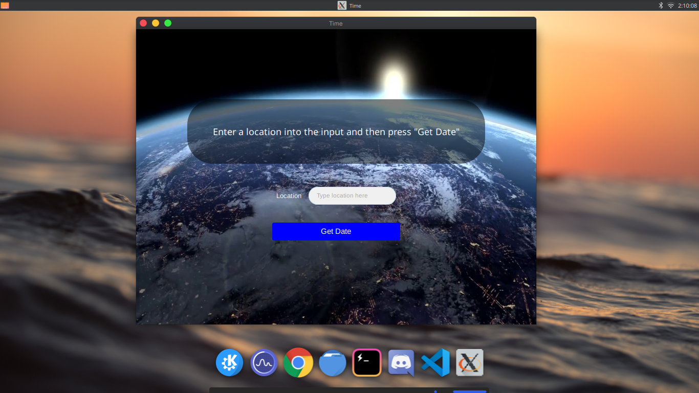

# WorldTimeGtkSharp
## Overview
This is a simple app that tells the time of a location. It uses GTK for its GUI.
## Run
To run this program you will need the [.NET Core CLI](https://dotnet.microsoft.com/download) installed to your machine. After that, you can simply run the program by typing `dotnet run` in the root directory of the project.
***

## Your own API Key?
To use your own API key from [World Weather Online](https://www.worldweatheronline.com/), you can use it by locating the [APIRequest.cs](https://github.com/tayinde/WorldTimeGtkSharp/blob/master/requests/APIRequest.cs#L15) file, going to line 16, and then replacing "your key" in `string apiKey = "put your key here";` with your API key.
