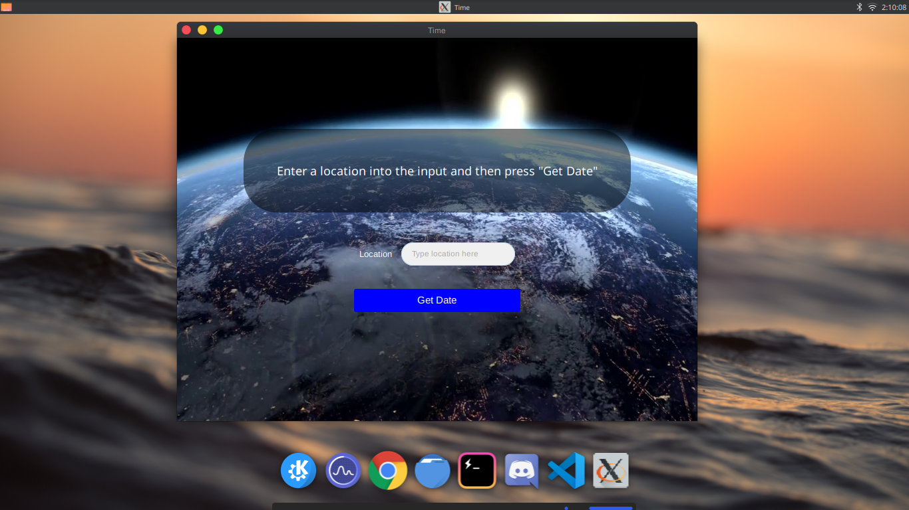

# WorldTimeGtkSharp
## Overview
This is a simple app that tells the time of a location. It uses GTK for its GUI.
## Run
To run this program you will need the [.NET Core CLI](https://dotnet.microsoft.com/download) installed to your machine. After that, you can simply run the program by typing `dotnet run` in the root directory of the project.
***

## Your own API Key?
If you have your own API key from World Weather Online, you can use it by locating the [APIRequest.cs](/APIRequest.cs) file and then replacing "public key" in `key.setValue("public key");` to your API key.
